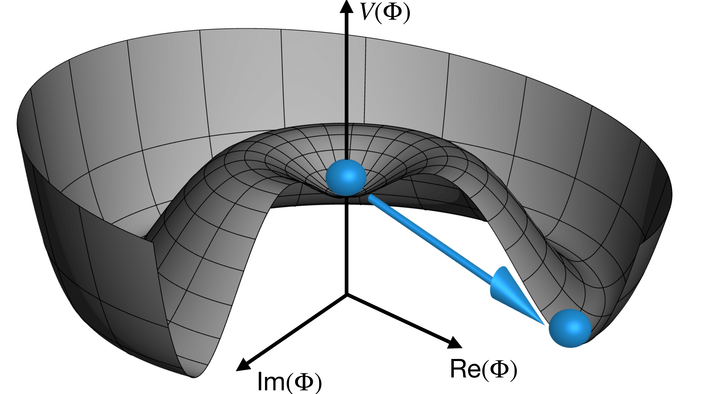
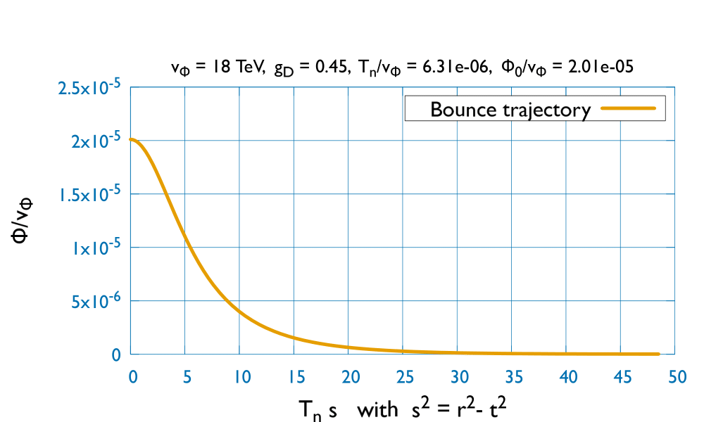
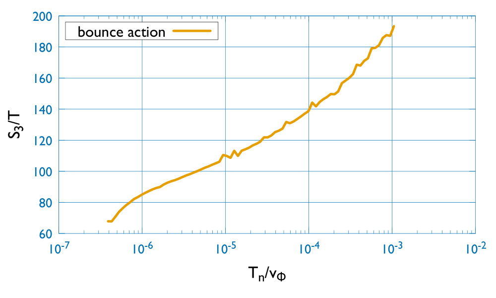

<div align="center">
</img>
</div>

## CCBounce: A C++ code to Calculate Bounce action and tunneling temperature in cosmological first-order phase transition scenarios.
[**Requirements**](#Requirements)
| [**Usage**](#Usage)
| [**Cite**](#Cite)

## Requirements

It only requires a c++ compiler. 	You can adapt the following line in the makefile to your system:

```console
$ g++  -std=c++11 CCBounce.cpp -o a.out && ./a.out
```

For visualization, it is required to install GNUPLOT:

MAC: 
```console
$ brew install gnuplot
```

LINUX:
```console
$ apt-get install gnuplot
```

The code can be simply runned with the commande "make" typed in a terminal opened in the same directory.
**This is a research project. Expect bugs, report bugs, fix more bugs than you
create.**

## Usage

The software calculates the bounce action with an over-shooting/under-shooting method, using Runge-Kutta order 5 with adaptive step-size.
Then it compares it with the critical action, calculate the nucleation temperature and the phase transition completion rate \beta/H.
The error on the bounce action and nucleation temperature are calculated and below percent level.
The code embeds the minimal scale-invariant U(1) extension of the Standard Model studied in https://arxiv.org/pdf/2311.13640.pdf.
The scale-invariant SU(2)_D model is also embedded.
It is straightforward to extend the code to any other phase transition model (scale-invariant or not).
Most of the lines of code are commented to help the user to understand its structure and implement any modifications.

Without any modification of the code, you can already use it to perform four tasks (in the scale-invariant U(1) extension of the Standard Model):
**1) Plot the scalar potential**
   
<figure>
  
  <figcaption align="center">
  </figcaption>
</figure>
<br/><br/>

**2) Calculate and plot the tunneling trajectory at a given temperature T**

<figure>
  
  <figcaption align="center"> 
  </figcaption>
</figure>
<br/><br/>

   
**3) Compute tables of bounce action values for a list of gauge coupling constant g_X and temperature T values**

   <figure>
  
  <figcaption align="center">
  The bounce action for different values of the temperature
  </figcaption>
</figure>
<br/><br/>

**5) Calculate the nucleation temperature T_n and the phase transition completion rate \beta/H**


## Cite
Please cite with bibtex:

@article{Gouttenoire:2023pxh,
    author = "Gouttenoire, Yann",
    title = "{Primordial Black Holes from Conformal Higgs}",
    eprint = "2311.13640",
    archivePrefix = "arXiv",
    primaryClass = "hep-ph",
    month = "11",
    year = "2023"
}
